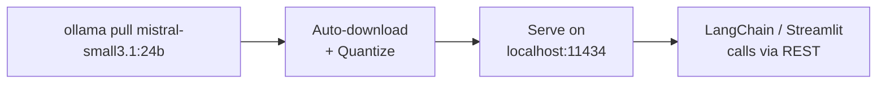
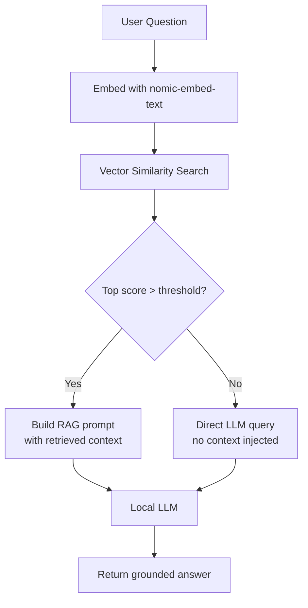
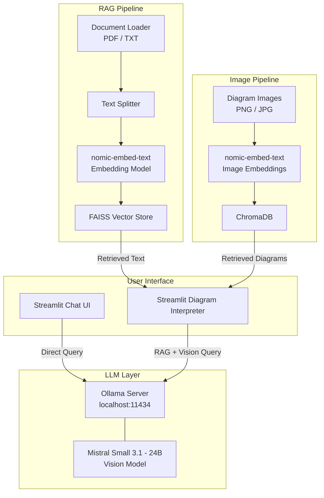
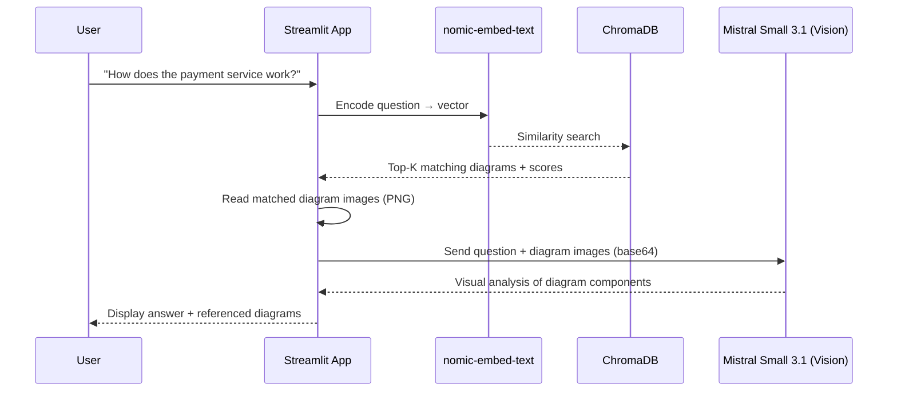
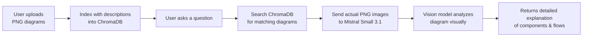

> An offline, privacy-first AI system that interprets design diagrams, documents, and images — powered by local LLMs, vector search, and multimodal embeddings. No cloud. No API keys. Everything runs on your machine.
{/* truncate */}

# ArchVision — A Local AI-Powered Design Assistant

## Table of Contents

1. [Project Overview](#1-project-overview)
2. [The Problem](#2-the-problem)
3. [Challenges](#3-challenges)
4. [The Solution](#4-the-solution)
5. [How It Works](#5-how-it-works)
6. [Vision-Powered Diagram Interpretation](#6-vision-powered-diagram-interpretation)
7. [Tech Stack](#7-tech-stack)
8. [Models Used](#8-models-used)
9. [Getting Started](#9-getting-started)
10. [What's Next](#10-whats-next)

---

## 1. Project Overview

**ArchVision** is a local AI system that can understand, retrieve, and answer questions about your design documents and diagrams — all running **100% offline** on your own hardware.

Engineering teams produce vast amounts of design artifacts: architecture diagrams, flowcharts, UML models, system block diagrams, and supporting documentation. Finding the right diagram or getting a quick answer about a design decision typically means digging through folders, wikis, or asking a colleague.

This project solves that by building a **Retrieval-Augmented Generation (RAG)** pipeline that:
- **Indexes** your text documents and design diagrams into a searchable vector database
- **Retrieves** the most relevant content when you ask a question
- **Generates** accurate, grounded answers using a local LLM — citing the source documents and displaying the referenced diagrams

At its core, we use **Mistral Small 3.1 (24B)** — a vision-capable model that can look at your PNG diagrams and describe what it sees: components, connections, flows, architecture layers, and more. This model runs locally via **Ollama**, alongside **nomic-embed-text** for embeddings, **ChromaDB** for image vector search, **FAISS** for text vector search, and **Streamlit** for the user interface.

### System Modes

| Mode | Description |
|------|-------------|
| **Direct Chat** | Conversational chat with the LLM — no document retrieval |
| **Text RAG** | Document-grounded Q&A — answers using your uploaded text files |
| **Diagram Interpreter** | Upload design diagrams, search by natural language, and get AI-powered visual analysis |

---

## 2. The Problem

In any engineering organization, design knowledge gets scattered:

- **Architecture diagrams** are buried in SharePoint, Confluence, or local folders
- **Design decisions** live in meeting notes, PDFs, and markdown files nobody reads after the first week
- **Onboarding engineers** spend days asking "where is the diagram for X?" or "why was this designed this way?"
- **Cross-team reviews** stall because reviewers can't quickly locate relevant design context
- **Proprietary designs** can't be uploaded to cloud AI services (ChatGPT, Gemini) due to IP and compliance constraints

**The core question:** How do you build an AI assistant that understands your design documents and diagrams — without sending any data to the cloud?

---

## 3. Challenges

Building a local AI-powered diagram interpreter presents several non-trivial challenges:

### 3.1 Running LLMs Locally Without GPU Clusters

State-of-the-art LLMs (GPT-4, Claude) require cloud APIs. Running models locally has historically required expensive GPUs, complex CUDA setups, and manual model quantization. Developer machines typically have 16–32 GB RAM and modest GPUs (or no GPU at all). Full-precision 70B models won't fit.

### 3.2 Embedding Text and Images in the Same Vector Space

Traditional text embedding models only handle text. Design diagrams are images. To search across both text and images with a single query, you need a **multimodal embedding model** that places text and images in the same vector space. Most multimodal models are large, cloud-only, or require separate pipelines.

### 3.3 RAG Quality — Avoiding Hallucination

A naive RAG pipeline will retrieve vaguely related chunks and the LLM will confidently generate an answer — even when the retrieved context doesn't actually contain the answer. This is **hallucination**, and in a design context it's dangerous (wrong architecture decisions, incorrect specs).

### 3.4 Image Retrieval with Metadata

Design diagrams need **metadata-aware retrieval** — "show me all architecture diagrams from the payment service" requires filtering by tags, file type, project name, etc. Pure vector similarity search alone isn't enough.

### 3.5 Keeping Everything Offline and Private

Many teams work on proprietary or regulated designs (medical devices, financial systems, defense). The entire stack — LLM inference, embedding generation, vector storage, and UI — must run locally with **zero network calls**.

---

## 4. The Solution

### 4.1 Ollama — One-Command Local LLM Serving

[Ollama](https://ollama.com) eliminates the complexity of running local models:
- Handles model downloading, quantization, and memory management automatically
- Serves models via a local REST API
- Supports CPU-only inference (with GPU acceleration when available)
- Supports **vision models** that can analyze images and diagrams directly
- Ollama uses quantized model which is easy on your personal laptop resources 



### 4.2 Unified Text + Image Embeddings

**nomic-embed-text** is a 768-dimensional embedding multi model that supports both text and image inputs in the **same vector space**, running locally via Ollama:
- The embedding model will convert image into embedding vectors and image file location in vector metadata
- A text query like *"payment service architecture"* can match against both documents AND diagrams
- No separate embedding pipelines for text vs. images
- Lightweight enough to run on CPU (~270 MB)

### 4.3 Smart Retrieval with Hallucination Guard

Our pipeline uses a **score-gated retrieval** strategy:



- If the relevance score is below a threshold → skip RAG entirely, query LLM directly
- If RAG is used but the LLM says "not enough information" → fall back to a direct query
- The system **never forces an answer from irrelevant context**

### 4.4 ChromaDB for Metadata-Rich Image Retrieval

We use **ChromaDB** for image vectors because it natively supports:
- Metadata filtering (e.g., filter by file type, project, tags)
- Combined vector + metadata queries in a single call
- Persistent storage — no manual save/load

FAISS remains the choice for text vectors (faster for pure similarity search).

### 4.5 Fully Offline Stack

Every component runs locally. After the one-time model download, the system operates with **zero internet connectivity**:

| Component | Runs On | Network Required? |
|-----------|---------|------------------|
| Ollama (LLMs) | localhost:11434 | No (after initial pull) |
| nomic-embed-text | localhost (via Ollama) | No |
| FAISS | In-process | No |
| ChromaDB | Local directory | No |
| Streamlit | localhost:8501 | No |

---

## 5. How It Works

### High-Level Architecture



### Diagram Search & Interpretation Flow



### What Makes This Different

Unlike typical RAG systems that only work with text, this system:

1. **MetaData Rich Vectors** — Users search anything about the image and embedding model converts them into vectors and fetches the actual image
2. **Sees your diagrams** — The LLM vision model receives the actual PNG images and analyzes them visually
3. **Searches by meaning** — Natural language queries find relevant diagrams even if the exact words don't match the filename
4. **Combines text + images** — Both documents and diagrams are searchable from a single query
5. **Runs 100% locally** — No data leaves your machine, ever

---

## 6. Vision-Powered Diagram Interpretation

The key differentiator of this project is the **vision capability**. Here's how it works:

### The Vision Pipeline



### What the Vision Model Can Do

When you upload a design diagram and ask about it, **Mistral Small 3.1** can:

- **Identify components** — boxes, services, databases, actors, modules
- **Trace data flows** — arrows, connections, request/response paths
- **Read labels** — text on components, annotations, legends
- **Understand UML** — sequence diagrams, use cases, class diagrams, deployment diagrams
- **Explain architecture** — layers, tiers, microservice boundaries, dependencies

### Example Interaction

> **You:** "What components are in the payment architecture?"
>
> **AI:** "Looking at the payment-service-architecture diagram, I can see three main components:
> 1. **Client** — the web frontend that initiates requests
> 2. **API Gateway** — handles routing, authentication, and request forwarding
> 3. **Database** — PostgreSQL instance for transaction storage
>
> The flow goes: Client → API Gateway → Database, following a classic three-tier architecture pattern."

The AI sees the actual diagram and describes what's visually present — not just guessing from a filename.

---

## 7. Tech Stack

| Component | Technology | Purpose |
|-----------|-----------|---------|
| **LLM Runtime** | Ollama | Serve local LLMs via REST API |
| **Language Model** | Mistral Small 3.1 (24B, Vision) | Text generation + diagram interpretation |
| **Embeddings** | nomic-embed-text (via Ollama) | Convert text/images → vectors |
| **Text Vector Store** | FAISS | Fast text similarity search |
| **Image Vector Store** | ChromaDB | Metadata-rich image retrieval |
| **Orchestration** | LangChain | Chain LLM, retriever, and prompts |
| **UI Framework** | Streamlit | Web-based chat interface |

---

## 8. Models Used

### LLMs (via Ollama)

| Model | Parameters | Size | Use Case | Vision |
|-------|-----------|------|----------|--------|
| **Mistral Small 3.1** | 24B | ~15 GB | Primary model — text generation + diagram interpretation | ✅ Yes |
| **Llama 3.2** | 3B | ~2 GB | Fast responses, lightweight text-only tasks | ❌ No |

The key requirement is an **open-source vision-language model** — one that can process both text prompts and images simultaneously. When a diagram is retrieved from ChromaDB, it's sent as a base64-encoded image directly to the model, which then analyzes it visually and generates a detailed explanation. Any vision-capable model available through Ollama (e.g., Mistral Small 3.1, LLaVA, Llama 3.2 Vision) can serve this role — choose based on your hardware capacity and accuracy needs.

### Embedding Model

| Model | Dimensions | Size | Use Case |
|-------|-----------|------|----------|
| **nomic-embed-text** | 768 | ~270 MB | Text → vector (FAISS) + Image descriptions → vector (ChromaDB) |

---

## 9. Getting Started

### Prerequisites

- Python 3.11+
- 32+ GB RAM (for Mistral Small 3.1)
- Windows / macOS / Linux

### Step 1: Install Ollama

Download from **https://ollama.com/download** and run the installer. On Windows, Ollama auto-starts as a background service.

### Step 2: Pull the Models

```powershell
# Vision model — can interpret diagrams (24B params, ~15 GB)
ollama pull mistral-small3.1:24b

# Embedding model — converts text to vectors (~270 MB)
ollama pull nomic-embed-text

# (Optional) Lightweight text-only model (~2 GB)
ollama pull llama3.2
```

### Step 3: Set Up Python Environment

```powershell
cd <your_project_folder>
python -m venv .venv

# Activate the virtual environment
# On Windows (PowerShell):
.\.venv\Scripts\Activate.ps1
# On Windows (CMD):
.\.venv\Scripts\activate.bat
# On macOS / Linux:
source .venv/bin/activate

pip install langchain langchain-ollama langchain-chroma
```

### Step 4: Run the Application

```powershell
streamlit run <your_app_script>.py
```

Replace `<your_app_script>` with the name of your Streamlit application file — the one that contains the diagram indexing, search, and LLM interpretation logic.

Opens at **http://localhost:8501** — upload diagrams, index them, and start asking questions.

---

## 10. What's Next

### Completed

- ✅ **Image RAG** — Diagram ingestion and retrieval using nomic-embed-text + ChromaDB
- ✅ **Vision-Powered Interpretation** — Mistral Small 3.1 analyzes PNG diagrams visually
- ✅ **Model Selector** — Switch between Mistral Small 3.1 and Llama 3.2 at runtime

### Planned

- **Streaming Responses** — Token-by-token output for a natural typing effect
- **Multi-modal Chat** — Combine text and image retrieval in a single query
- **Conversation Memory** — Persist chat history across sessions
- **Document Management** — View, delete, and tag documents and diagrams from the UI
- **Diagram Diff** — Compare two versions of a diagram and summarize changes

---

*ArchVision — Built with LangChain, Ollama (Mistral Small 3.1 Vision), FAISS, ChromaDB, and Streamlit. Running entirely on local hardware. No cloud. No compromises.*
