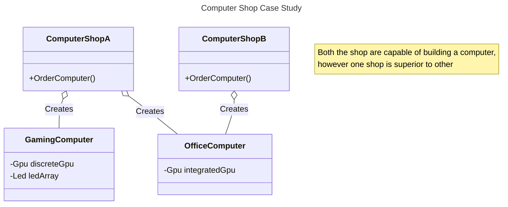
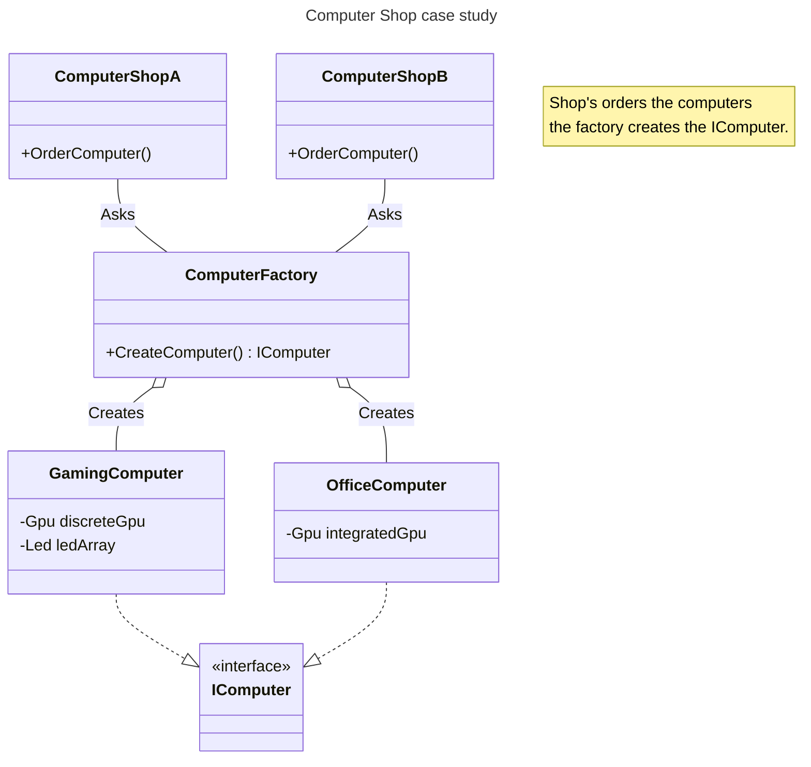

# Simple Factory

Simple factory is one of the simplest pattern, the goal of simple factory is to enable creation of various set of known objects, while hiding the details and steps involved in creating the object. The factory itself is either denoted as a single function/method, however it acceptable to have a separate class for the same. Jump [here](#formal-definition) for formal definition.

## 🥲Problem - Case Study

Imagine that you are running a computer shop which sells Gaming computer and you assemble the computer yourself whenever you receive a new order, due to recent success you decide to open another computer shop which sells office computer and upgrade the old shop to also sell office computer. Now orders are arriving from 2 different place with various configurations and you find it haphazard and difficult to manage and assemble both gaming and office computer. 

With this arrangement supply chain management, assembly, tracking the parts, packaging etc will need to be established and followed to perfection in two shops. This arrangement will be difficult to scale and manage in the long term since every existing and shop needs to know every detail of building a computer.

## 💡Solution - Case study

A practical solution for such a problem is to introduce a computer factory, the factory will receive a order from the shop. After this point factory will be responsible to collect, assemble, install the parts and ship a neatly wrapped computer which is ready to handover to the customer. The shop in-fact does not even need to know what's inside the package. Majority of the complexity and management is now hidden inside the factory and is only repeated once, this makes it much easier to manage and scale the shops.

## Formal Definition

In object-oriented programming, a factory is an object for creating other objects; formally, it is a function or method that returns objects of a varying prototype or class from some method call, which is assumed to be new. More broadly, a subroutine that returns a new object may be referred to as a factory, as in factory method or factory function. The factory pattern is the basis for a number of related software design patterns.[1]

### Context

### Problems

### Solution

### Consequences

## Interactions

## Examples in the wild

- [WebRequest.Create](https://learn.microsoft.com/en-us/dotnet/api/system.net.webrequest.create?view=net-10.0)
- [DbProviderFactories.GetFactory](https://learn.microsoft.com/en-us/dotnet/api/system.data.common.dbproviderfactories)
- [std::make_shared](https://en.cppreference.com/w/cpp/memory/shared_ptr/make_shared.html)

## Further Reading & References

[1] [Factory (object-oriented programming)](https://en.wikipedia.org/wiki/Factory_(object-oriented_programming))

##### Contributors

> [Loknath](https://github.com/loknath2002)
