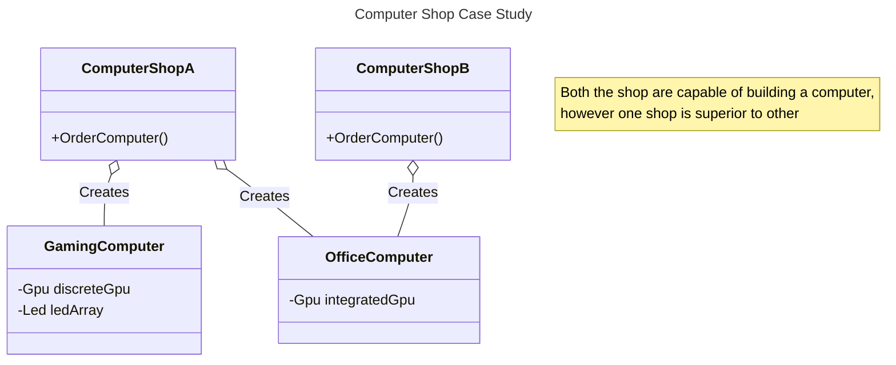
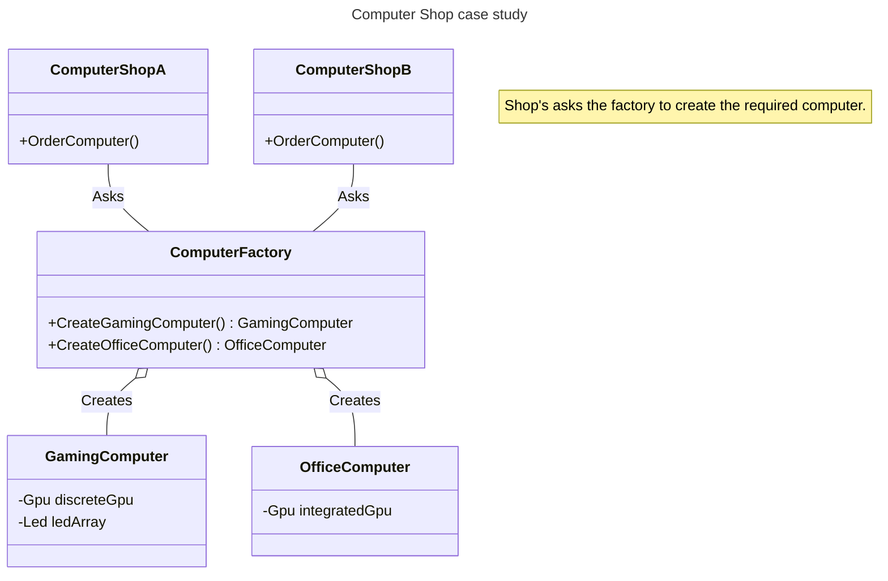

import Tabs from '@theme/Tabs';
import TabItem from '@theme/TabItem';

# Simple Factory

Simple factory is one of the simplest design pattern, the goal of simple factory is to enable creation of various set of known objects, while hiding the details and steps involved in creating the object. The factory itself is either denoted as a single function/method, however it acceptable to have a separate class for the same. Jump [here](#formal-definition) for formal definition.

## Problem 🤔

Imagine that you are running a computer shop which sells Gaming computer and you assemble the computer yourself whenever you receive a new order, due to recent success you decide to open another computer shop which sells office computer and upgrade the old shop to also sell office computer. Now orders are arriving from 2 different place with various configurations and you find it haphazard and difficult to manage and assemble both gaming and office computer. 



With this arrangement supply chain management, assembly, tracking the parts, packaging etc will need to be established and followed to perfection in two shops. This arrangement will be difficult to scale and manage in the long term since every existing and shop needs to know every detail of building a computer.

## Solution 💡

A practical solution for such a problem is to introduce a computer factory, the factory will receive a order from the shop. After this point factory will be responsible to collect, assemble, install the parts and ship a neatly wrapped computer which is ready to handover to the customer. The shop in-fact does not even need to know what's inside the package. Majority of the complexity and management is now hidden inside the factory and is only repeated once, this makes it much easier to manage and scale the shops.



## Formal Definition 📖

In object-oriented programming, a factory is an object for creating other objects; formally, it is a function or method that returns objects of a varying prototype or class from some method call, which is assumed to be new. More broadly, a subroutine that returns a new object may be referred to as a factory, as in factory method or factory function. [1]

### Context

Multiple parts of the code be it Classes or Function want to create instances of another ClassX, the creation of the set class has medium to high complexity and direct dependencies. 

### Problems

Problems observed in the client/calling code in given context

- Client code will need to know and understand how to create an instance of ClassX
- ClassX's dependencies/imports/headers/usings are required to be inherited by calling/client code.
- Changes in creation steps of ClassX will break client code.
- Introduces code duplications.
- Difficult to test since ClassX's and it's dependencies cannot be replaced by mocks/stubs/fakes.
- Difficult to optimize ClassX, for instance to manage the lifetime of the created objects.

### Solution

Introduce a **Simple Factory** class which encapsulates all the steps involved in creation of the target object.

#### Steps 

1. Identify the steps involved in creating the target object(ClassX).
2. Create a dedicated Factory Class and move all the creation logic to the new factory classes's function.
3. Limit the access to the target object(ClassX) constructor, this ensures that instance can only be created via the factory
4. Update the usages in client/calling code to use the new factory.

### Consequences

Some but not a extensive list of consequences of Simple Factory pattern's,

- ✅Ensures **Loose coupling** between classes, reduces **dependencies** while encouraging **encapsulation**.
- ✅Encourages **Single responsibility principle**, factory ensure the object creation logic is centralized.
- ✅Encourages **testability**.
- ✅Reduces **code-duplicate** and improves **readability**.
- ✅Opens the opportunity to object lifetime centrally.
- ❗Increase in overall **complexity** due to additional class/functions.
- ❗Potential performance and memory overhead, (this for instance might be critical in Embedded Systems)

## Interactions 🤝

Simple factory pattern interacts with various patterns,

- Factory Method: Simple Factory is often the first step toward this pattern. As the factory method grows it becomes beneficial to move towards factory method.
- Abstract Factory: While a Simple Factory creates one product, an Abstract Factory groups multiple related factory methods to create families of products.
- Singleton: Simple Factories are frequently implemented as Singletons to provide a single, global access point for object creation.

## Code Sample 👾

<Tabs>
  <TabItem value="c#" label="C#" default>
    ```csharp
    public sealed class GamingComputer 
    { 
        internal GamingComputer() { }
    }

    public sealed class OfficeComputer 
    {
        internal GamingComputer() { }
    }
    
    public sealed class ComputerFactory
    {
        private ComputerFactory() { }
       
        // This itself is a factory method in a singleton class.
        public static readonly ComputerFactory Instance = new ComputerFactory();

        public GamingComputer CreateGamingComputer() => new GamingComputer();

        public OfficeComputer CreateOfficeComputer() => new OfficeComputer();
    }
```
  </TabItem>
  <TabItem value="python" label="Python">
```python
from enum import Enum, auto
class ComputerType(Enum):
    GAMING = auto()
    OFFICE = auto()

class GamingComputer:
    def __init__(self):
        pass

class OfficeComputer:
    def __init__(self):
        pass

class ComputerFactory:

    # One can see it is possible to have single factory method with multiple object types
    @staticmethod
    def create_computer(self, computer_type: ComputerType):
        match computer_type:
            case ComputerType.GAMING:
                return GamingComputer()
            case ComputerType.OFFICE:
                return OfficeComputer()
            case _:
                raise ValueError(f"Unsupported computer type: {computer_type}")

    ```
  </TabItem>
</Tabs>

## Examples in the wild

- [WebRequest.Create](https://learn.microsoft.com/en-us/dotnet/api/system.net.webrequest.create?view=net-10.0)
- [DbProviderFactories.GetFactory](https://learn.microsoft.com/en-us/dotnet/api/system.data.common.dbproviderfactories)
- [std::make_shared](https://en.cppreference.com/w/cpp/memory/shared_ptr/make_shared.html)

## Further Reading & References

[1] [Factory (object-oriented programming)](https://en.wikipedia.org/wiki/Factory_(object-oriented_programming))

##### Contributors 

> [Loknath](https://github.com/loknath2002)
