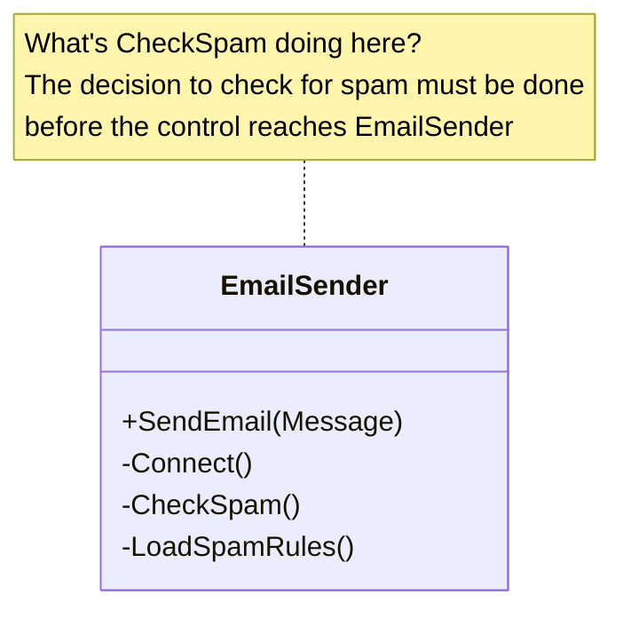
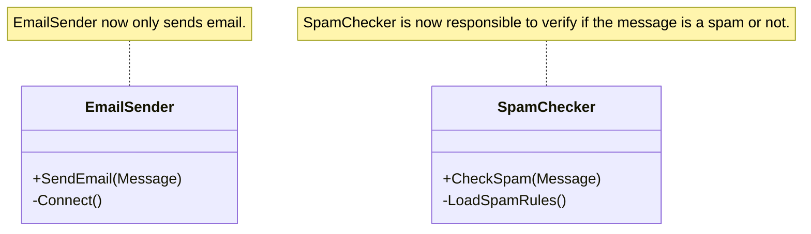

# SOLID Design Principles

SOLID is an acronym for five design principles that provide a foundation for writing software that is **loosely coupled, modular, maintainable, and easy to test.** While these principles are most commonly associated with object-oriented programming, they can also be applied at **different levels and stages of software design and development.** The SOLID principles were introduced by Robert C. Martin (Uncle Bob).

The five SOLID principles

- **S — Single Responsibility Principle**
- **O — Open-Closed Principle**
- **L — Liskov Substitution Principle**
- **I — Interface Segregation Principle**
- **D — Dependency Inversion Principle**

## Single Responsibility Principle

The general idea of single responsibility principle is to ensure that a class, module or a function at most has one responsibility/job and has only one reason to change. 

:::info Challenges

It is often difficult to ensure SRP is followed at a function level, a function most of the times will have multiple steps and it's easy to break SRP. A function should ideally do one conceptual task, not multiple sequential tasks that could change independently.

For instance consider the implementation detail of a function `SendEmail`, the function makes a connection to smtp server to send the email but just before sending it checks if the email is a spam. Here making a connection is a requirement and is ok but checking email for spam is a violation of SRP.

:::

### Benefits
- Increase cohesion decrease coupling
- Improves testability, single responsibility meaning one thing to test.
- Improves readability, easier to navigate and understand the code.
- Improves maintainability, focused modules, classes and functions clearly reflect what needs to change and where it needs to change. 

### Real-world Examples 
- [OpenCV's imgproc](https://docs.opencv.org/4.x/d7/dbd/group__imgproc.html) module focuses only on image processing.
- [TextReader](https://learn.microsoft.com/en-us/dotnet/api/system.io.textreader?view=net-10.0) class focuses on reading only characters.
- [re.match()](https://docs.python.org/3/library/re.html#re.Match) focuses only on matching strings.

### Class Diagram 
#### Problem

#### Solution

## Open-Closed Principle

## Liskov Substitution Principle

## Interface Segregation Principle

## Dependency Inversion Principle

## Further Reading & References

Remove all the bullet points if there are no references to record.

- [Wikipedia - Markdown](https://en.wikipedia.org/wiki/Markdown)
- External Links to additional content, other websites, papers, books, so on. 

##### Contributors

> [Loknath](https://github.com/loknath2002)
