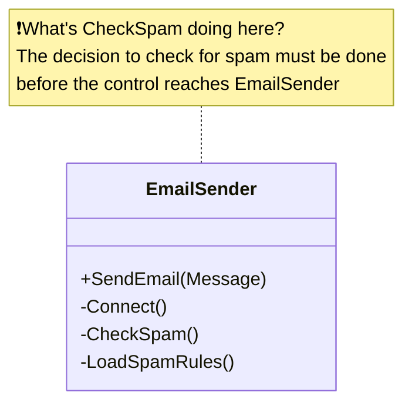
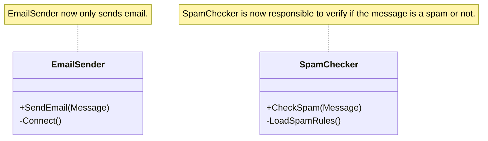
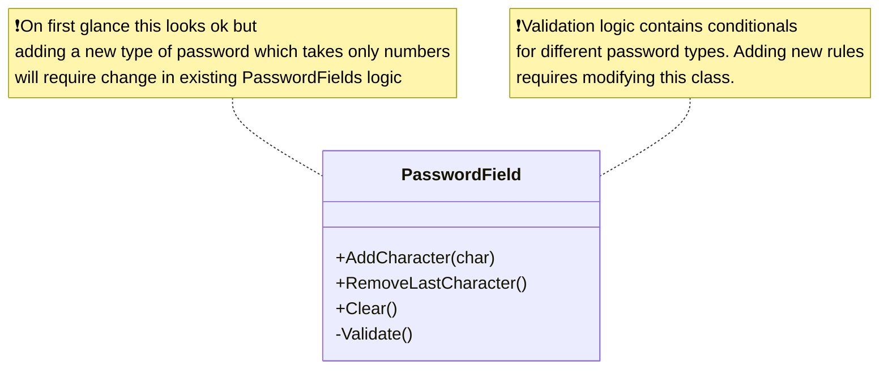
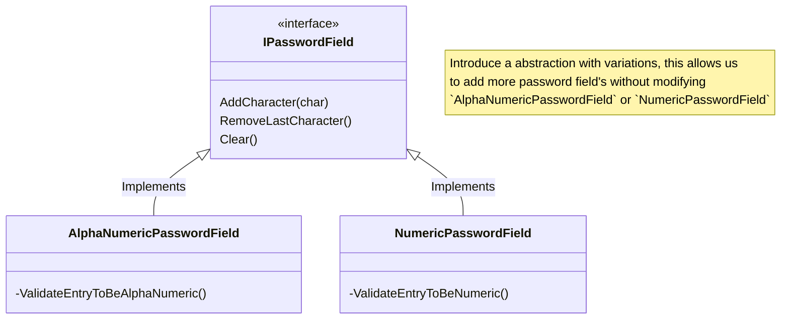
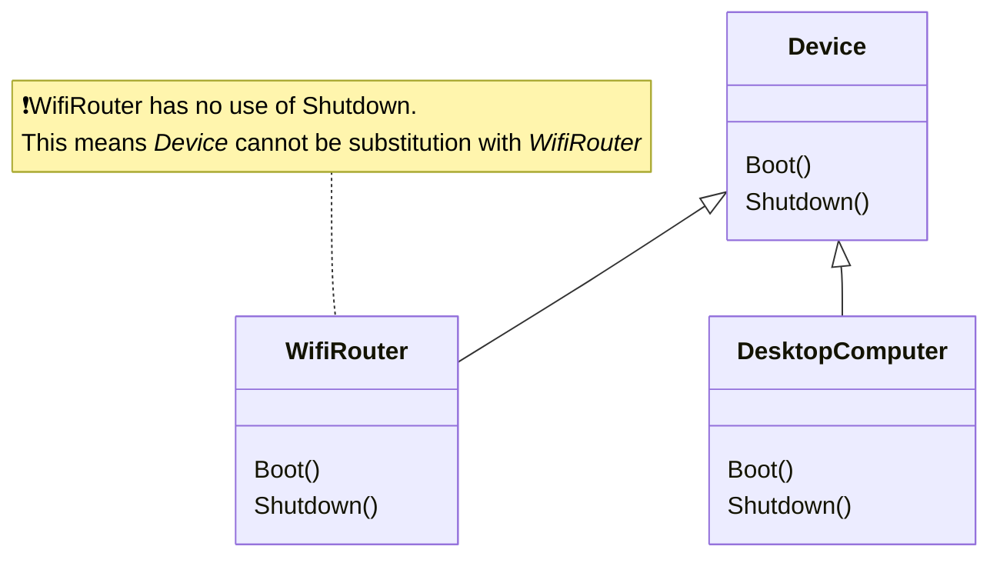
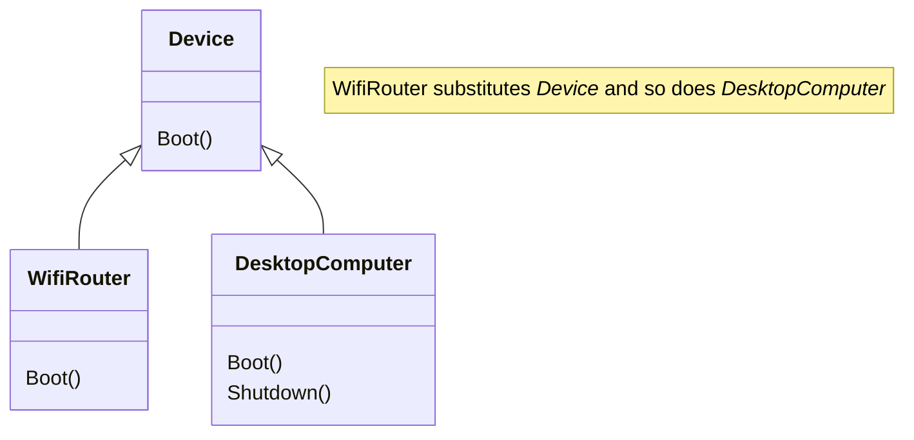

# SOLID Design Principles

SOLID is an acronym for five design principles that provide a foundation for writing software that is **loosely coupled, modular, maintainable, and easy to test.** While these principles are most commonly associated with object-oriented programming, they can also be applied at **different levels and stages of software design and development.** The SOLID principles were introduced by Robert C. Martin (Uncle Bob).

The five SOLID principles

- **S — Single Responsibility Principle**
- **O — Open-Closed Principle**
- **L — Liskov Substitution Principle**
- **I — Interface Segregation Principle**
- **D — Dependency Inversion Principle**

## Single Responsibility Principle

The general idea of single responsibility principle is to ensure that a class, module or a function at most has one responsibility/job and has only one reason to change. 

:::info Challenges

It is often difficult to ensure SRP is followed at a function level, a function most of the times will have multiple steps and it's easy to break SRP. A function should ideally do one conceptual task, not multiple sequential tasks that could change independently.

For instance consider the implementation detail of a function `SendEmail`, the function makes a connection to smtp server to send the email but just before sending it checks if the email is a spam. Here making a connection is a requirement and is ok but checking email for spam is a violation of SRP.

:::

### Benefits
- Increase cohesion decrease coupling
- Improves testability, single responsibility meaning one thing to test.
- Improves readability, easier to navigate and understand the code.
- Improves maintainability, focused modules, classes and functions clearly reflect what needs to change and where it needs to change. 

### Real-world Examples 
- [OpenCV's imgproc](https://docs.opencv.org/4.x/d7/dbd/group__imgproc.html) module focuses only on image processing.
- [C# TextReader](https://learn.microsoft.com/en-us/dotnet/api/system.io.textreader?view=net-10.0) class focuses on reading only characters.
- [Python re.match()](https://docs.python.org/3/library/re.html#re.Match) focuses only on matching strings.

### Class Diagram 

#### Problem

```mermaid
classDiagram
    note for EmailSender "❗What's CheckSpam doing here?
    The decision to check for spam must be done 
    before the control reaches EmailSender"
    class EmailSender {
        +SendEmail(Message)
        -Connect()
        -CheckSpam()
        -LoadSpamRules()
    }
```
#### Solution

```mermaid
classDiagram
    note for EmailSender "EmailSender now only sends email."
    note for SpamChecker "SpamChecker is now responsible to verify if the message is a spam or not."
    class EmailSender {
        +SendEmail(Message)
        -Connect()
    }

    class SpamChecker {
        +CheckSpam(Message)
        -LoadSpamRules()
    }
```

## Open-Closed Principle

OCP encourages a design direction where **software entities (classes, modules, functions, etc.) should be open for extension, but closed for modification[1]**

:::info Challenges

OCP is one of the difficult principles to achieve. How does one design a class/interface/function which is never supposed to be changed but extendable? 

- Look out for variation's of a single operation, a function like `Pay` in payment processing, function like `Draw` in drawing application are prime candidates for closure.
- OCP is typically implemented using abstractions and polymorphism on stable well known/well defined behaviors as illustrated in above point.
- Let's bring back SRP into picture here, a class which breaks SRP will most likely make implementing OCP difficult.
- There is no need for 100% Closure. Requirements change and hence the code.
- Consider using plugins for larger modules

:::

### Benefits
- Extendability : Adding new features to the code is streamlined.
- Maintainability : Reduces the risk of breaking existing functionality.

### Real-world Examples 
- [C# Stream](https://learn.microsoft.com/en-us/dotnet/api/system.io.stream?view=net-10.0) Adding a new compression stream (e.g., LZMA) does not require modifying existing stream implementations.
- [Python Logging Module](https://docs.python.org/3/library/logging.html#logging.Logger.addHandler) allows adding more handlers/plugin without needing any change in logging module.

### Class Diagram 

#### Problem

```mermaid
classDiagram
    note for PasswordField "❗On first glance this looks ok but 
    adding a new type of password which takes only numbers
    will require change in existing PasswordFields logic"
    note for PasswordField "❗Validation logic contains conditionals
    for different password types. Adding new rules
    requires modifying this class."
    class PasswordField {
        +AddCharacter(char)
        +RemoveLastCharacter() 
        +Clear()
        -Validate()
    }
```
#### Solution

```mermaid
classDiagram
note "Introduce a abstraction with variations, this allows us
 to add more password field's without modifying
`AlphaNumericPasswordField` or `NumericPasswordField`"
IPasswordField <|-- AlphaNumericPasswordField : Implements
IPasswordField <|-- NumericPasswordField : Implements
class IPasswordField {
    <<interface>>
    AddCharacter(char)
    RemoveLastCharacter()
    Clear()
}

class AlphaNumericPasswordField {
    -ValidateEntryToBeAlphaNumeric()
}

class NumericPasswordField {
    -ValidateEntryToBeNumeric()
}
```

## Liskov Substitution Principle

LSP encourages proper hierarchical relations, in object-oriented programming stating that an object (such as a class) may be replaced by a sub-object (such as a class that extends the first class) without breaking the program.[3]

:::info Challenges

LSP is *very deceptive* and can easily lead to incorrect relationships and inheritance. Is Square a Rectangle? Is Penguin a Bird? 

- Focus on specialization and then generalization, once the generalized patterns emerge from specialization refactor the repeating features into generalized super-class. 
- Focus on immediate parent and substitution with the same. `Dollar` should substitute `Currency`. Since `Currency` substitutes `Money`, `Dollar` also implicitly substitutes `Money`.
- Look out for common behaviors. For example, a `Computer` can `Boot`, so `Boot` may belong in a base/super class for computer-like devices. In a different example, a `Battery` can `Charge`, so `Charge` may belong in a base/super class for battery-related types.
- If the relationship is not obvious, consider using composition over inheritance, this would prevent breaking LSP while still providing benefits of Reusability, Testability and Maintainability

:::

### Benefits
- Reusability : Inherited/Sub-class can benefit from existing code.
- Testability : Easier to test, i.e each Inherited/sub-class just needs to test itself.
- Maintainability : Easier to maintain due to better testability and code reuse.

### Real-world Examples 
- [OpenCV Feature2D](https://docs.opencv.org/3.4/d0/d13/classcv_1_1Feature2D.html) Any of the algorithms can replace the base class Feature2D without breaking code.
- [C# IEnumerable](https://learn.microsoft.com/en-us/dotnet/api/system.collections.generic.ienumerable-1?view=net-10.0) Any collection (List, Array, HashSet, Dictionary, etc.) can be used wherever IEnumerable is expected.

### Class Diagram 

#### Problem

```mermaid
classDiagram
note for WifiRouter "❗WifiRouter has no use of Shutdown.
This means *Device* cannot be substitution with *WifiRouter*"
Device <|-- WifiRouter
Device <|-- DesktopComputer
class Device {
    Boot()
    Shutdown()
}

class WifiRouter {
    Boot()
    Shutdown()
}

class DesktopComputer {
    Boot()
    Shutdown()
}
```
#### Solution

```mermaid
classDiagram
note "WifiRouter substitutes *Device* and so does *DesktopComputer*"
Device <|-- WifiRouter
Device <|-- DesktopComputer
class Device {
    Boot()
}

class WifiRouter {
    Boot()
}

class DesktopComputer {
    Boot()
    Shutdown()
}
```

## Interface Segregation Principle

## Dependency Inversion Principle

## Further Reading & References

- [1] [Wikipedia - Open–closed principle](https://en.wikipedia.org/wiki/Open%E2%80%93closed_principle)
- [2] [objectmentor](https://objectmentor.com/resources/articles/ocp.pdf)
- [3] [Wikipedia - Liskov substitution principle](https://en.wikipedia.org/wiki/Liskov_substitution_principle)

##### Contributors

> [Loknath](https://github.com/loknath2002)
